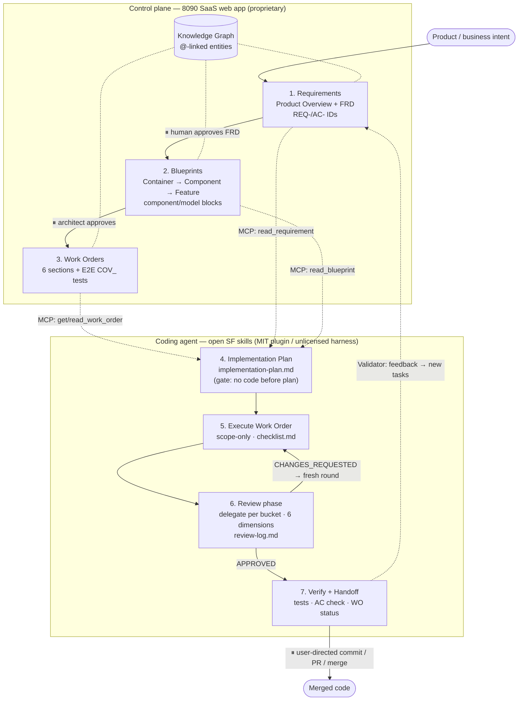

# Evaluation: 8090 Software Factory

**Site:** [8090.ai](https://www.8090.ai/) · [docs](https://www.8090.ai/docs/general/introduction) · [quickstart](https://www.8090.ai/docs/general/quickstart) · [EY.ai PDLC](https://www.ey.com/en_us/services/consulting/ai-native-pdlc-reinventing-software-delivery)
**Open companion repos:** [software-factory-plugin](https://github.com/8090-inc/software-factory-plugin) (MIT, ★6) · [software-factory-harness](https://github.com/8090-inc/software-factory-harness) (no license, ★6)
**Stars:** n/a for the SaaS (commercial, no public repo); companion plugins ★6 each | **Last updated:** plugin 2026-06-08, harness 2026-03-17 | **License:** SaaS proprietary; **plugin MIT**; harness unlicensed
**Last verified:** 2026-06-29
**Dev loop stage:** Plan (requirements → specs → work orders is the differentiator; the platform then spans Implement → Ship → Reflect)
**Layer:** Infrastructure (AI-native SDLC control plane / platform)

---

## What it does

8090's **Software Factory** is a commercial **"AI-native SDLC control plane"** — a platform that drives software from *business intent* to *production code* through a mesh of specialized AI agents under continuous human oversight, with a full audit trail. It is co-launched with EY as the **EY.ai PDLC** (Product Development Lifecycle) and aimed at regulated enterprises (healthcare, financial services, manufacturing, government) where compliance visibility and traceability matter.

Its thesis is that "single-player" AI coding tools are fast but sloppy because they skip the front of the lifecycle (requirements refinement, architecture capture, work planning) and leave no auditable trail. Software Factory orchestrates the *whole* loop instead, feeding agents structured context rather than vague prompts. The documented pipeline is a chain of modules, each producing a durable artifact:

- **Requirements** → a Product Requirements Document (PRD) — "Define your product."
- **Blueprints** (powered by a *Feature Extraction Agent*) → structured **Feature Nodes** that expand the PRD into implementation specs — "Translate vision into specs."
- **Work Orders** / **Planner** → actionable, codebase-tied development tasks that name files to create/update — "Turn specs into tasks."
- **Development** → code, tests, documentation, and infrastructure.
- **Validator** → converts user feedback into new development tasks — "Close the loop."

Two cross-cutting elements bind these together: a **Knowledge Graph** that links requirements, architecture, and implementation as a single source of truth and automatically propagates changes across artifacts; and a **control plane** that keeps "full control, visibility, and auditability over every decision from start to finish," with human oversight focused on intent, scope, and governance. Collaboration is "multiplayer" — PM, design, engineering, and business stakeholders co-create against shared context.

## How we tested it

**Evidence:** REVIEW

**Source-grounded review — not run hands-on.** The commercial Software Factory platform is closed (no public repo, free tier, or self-serve trial available to us); we did not install, log into, or run it, and its quantitative results are quoted as the **vendor's** claims, not measured by us. **What is new in this revision:** 8090 has since published two open companion repos whose skill files we **read at source** (file contents, not executed) — so the *SDLC, Skills, and Workflow* sections below are now grounded in primary-source skill definitions rather than marketing copy. We still did not *run* the plugin or harness, so this remains a REVIEW, not a MEASURED, evaluation.

```
# SaaS docs (vendor framing, read not run):
https://www.8090.ai/                                  # product positioning, three-phase model
https://www.8090.ai/docs/general/introduction         # modules + artifacts pipeline
https://www.8090.ai/docs/general/quickstart           # 8-step web→MCP→IDE flow
https://www.8090.ai/docs/modules/planner              # Planner / Work Orders
https://www.ey.com/.../ai-native-pdlc-...             # EY.ai PDLC lifecycle framing
# PR (EY + 8090 launch) cites a vendor case study: ~70% productivity gain,
# "80x" faster delivery, 95%+ automated test coverage — 8090/EY figures, unverified by us.

# Open companion repos — skill/guide/script files read at SOURCE (not run):
https://github.com/8090-inc/software-factory-plugin    # MIT: SKILL.md + guides/ + execution/ + scripts/ + tests
https://github.com/8090-inc/software-factory-harness   # unlicensed: standalone Cursor-oriented harness, same pipeline
```

## The SDLC (from the open-source skills)

Software Factory's methodology is a **traceable pipeline** connecting *product intent → technical intent → implementation work*, where every stage emits a durable, cross-linked artifact. The open skill files define seven stages (the SaaS web app owns stages 1–3; the open plugin/harness skills own stages 4–7, bridged by MCP):

| # | Stage | Artifact produced | Consumes | What the agent does | SaaS module |
|---|-------|-------------------|----------|---------------------|-------------|
| 1 | **Requirements** | Product Overview Docs + **Feature Requirements Documents (FRDs)** | Product/business intent | External-perspective specs: user stories `REQ-{PREFIX}-{NNN}` + acceptance criteria `AC-{PREFIX}-{NNN}.{N}` ("When [condition], the system shall [behavior]") | **Refinery** (PMs) |
| 2 | **Blueprints** | Container / Component / **Feature Blueprints** | An FRD (+ feature graph) | Internal-perspective "written diagrams": `component`/`model` blocks (nodes) + relationship prose (edges), tracing up to Requirements and down to code | **Foundry** (architects) |
| 3 | **Work Orders** | A **Work Order** (Summary, In/Out of Scope, Requirements, Blueprints, E2E Acceptance Tests) | Blueprints decomposed into tasks | A narrowly-scoped, traceable task linking the right Requirements + Blueprints; defines E2E `COV_` test coverage | **Planner** (PMs/tech leads) |
| 4 | **Implementation Plan** | `implementation-plan.md` | Work Order + linked Reqs + Blueprints | Translates context into concrete repo changes: reuse/structure, components & flow, ordered steps, testing (**gate: no code before a plan exists**) | execution (MCP) |
| 5 | **Execute** | Code + per-WO dir `.sw-factory/WO-<n>/` (plugin) / `scratch/wo-execution/WO-<n>/` (harness) | Implementation plan | Gathers context via MCP, implements **only WO scope**, ticks a mandatory `[x]`/`[SKIP]` checklist | execution (MCP) |
| 6 | **Review** | `review-log.md` (appended rounds) | Merge-base diff | Spawns one **review delegate subagent per bucket** across 6 dimensions (Requirements, Blueprint, Architecture, Tests/build, User-facing, Security); yields `APPROVED` / `CHANGES_REQUESTED` | execution |
| 7 | **Verify & Handoff** | Updated WO status + PR | Approved review | Runs tests, confirms ACs + Blueprint alignment, sets WO `in_review` (plugin) / calls `complete_work_order` (harness) — **version control stays user-directed** | execution |

A **Validator** feedback loop converts post-deployment user feedback into new Requirements/tasks, closing the cycle. Persistent context between stages is the **entity graph** of `@`-linked Requirements/Blueprints/Work Orders/Artifacts (the SaaS "Knowledge Graph") plus the per-WO execution directory (`checklist.md` + `context.md` + `implementation-plan.md` + `review-log.md`).

## The skills

The open plugin ships a **single top-level `software-factory` skill that acts as a router** (a SKILL.md "directory") into guides (authoring) and execution (running) sub-files — skills only, no bundled agents or commands (`agents: []`, `commands: []`, empty `.mcp.json` stub for teams to wire their own server):

| Skill / file | Job |
|--------------|-----|
| `skills/software-factory/SKILL.md` | Top-level entry/router; defines Records (Requirements, Blueprints, Delivery) + routing table | 
| `guides/requirements-writing-guide.md` | How to write Product Overview Docs + FRDs (sections, `REQ-`/`AC-` IDs, shall/should/may, split/merge/nest) |
| `guides/blueprint-writing-guide.md` | How to write Container/Component/Feature Blueprints (`component`/`model` block syntax, `#`/`` ` ``/`@` mentions, ADRs) |
| `guides/work-order-writing-guide.md` | How to write a Work Order (6 required sections, E2E `COV_` test specs, quality bar) |
| `execution/writing-implementation-plans.md` | Structure/rules for `implementation-plan.md` (reuse-first, 5 sections) |
| `execution/execute-work-order.md` | Single/multi-WO execution (7 steps, mandatory checklist, sequential batch rules) |
| `execution/review-phase.md` | Isolated full review pass; delegate-per-bucket; 6 dimensions; verdict loop |

**Scripts/templates** (`execution/scripts/`): `init-wo-execution.sh` (scaffolds the four per-WO files), `update-context-index.sh` (populates `context.md` with `--requirement`/`--blueprint` links), and `*-template.md` for checklist / context / implementation-plan / review-log.

**Separate `skill-evaluator` skill** (in `scratch/`, ISC license — not part of the shipped plugin): a meta-skill that evaluates *any* SKILL.md across model tiers (opus→sonnet→haiku) via blind `test-subject` agents and an `experimenter`, producing refinement recommendations. Exposes a `commands/evaluate.md` (`name: evaluate`, args `skill-path` + `test-cases-path`) — the only declared command/agents in either repo.

The harness encodes the **same pipeline** but with a live MCP server assumed, exposing concrete tools: `get_next_work_order`, `start_work_order`, `read_work_order`, `read_requirement`, `search_requirements`, `read_blueprint`, `search_blueprints`, `complete_work_order`.

## Workflow diagram



⏸ = human-in-the-loop checkpoint. Solid arrows are the authored pipeline; dotted arrows are MCP context reads, the Validator feedback loop, and Knowledge-Graph linkage.

## Open-source companion: plugin vs. harness

The two repos package the **identical methodology** differently — and their **licenses differ, which decides adoptability**:

| Aspect | `software-factory-plugin` | `software-factory-harness` |
|--------|---------------------------|----------------------------|
| License | **MIT** → adoptable under our bar | **none** → SKIP (not adoptable) |
| Packaging | Productized, multi-platform (`npx skills add`; dist for Claude, Cursor, Codex, Gemini, Kiro, Vercel); pnpm + Vitest tests + Husky + CI | Earlier, leaner, Cursor-oriented standalone (`.cursor/skills/...`) |
| MCP | empty `{}` stub — bring your own server | live MCP server with concrete tools assumed |
| Execution dir | `.sw-factory/WO-<n>/` | `scratch/wo-execution/WO-<n>/` |
| Execution split | `execute-work-order.md` + `review-phase.md` | `start-work-order.md` + `complete-work-order.md` |
| Hosted service | explicitly **not required** | assumes the Software Factory platform |

The plugin's design note matters for an open-tool stack: it "does not assume access to a hosted Software Factory service" and ships an **empty MCP config** — so the *methodology-as-skills* is usable standalone, decoupled from the paid control plane. That is the genuinely adoptable artifact here (subject to a hands-on run, which we have **not** done).

## What worked

- **Front-loaded lifecycle is the right critique.** The core insight — that prompt-only coding tools fail because they skip requirements/architecture/planning and leave no trail — matches what this repo's WORKFLOW.md argues about the Plan stage. The artifact chain (PRD → Feature Nodes → Work Orders) is a coherent intent→code path.
- **Knowledge Graph as single source of truth.** Linking requirements↔architecture↔implementation with automatic change propagation is the strongest idea here: it attacks specification drift directly, which most agent tools ignore.
- **Auditability as a first-class concern.** A control plane that records "every decision start to finish" is genuinely differentiated and is the feature that makes it credible for regulated delivery — most agent orchestration tools have no audit story.
- **Human oversight by design.** Keeping humans on intent/scope/governance while agents execute is a defensible division of labor rather than full autonomy.

## What didn't work or surprised us

- **Proprietary, closed, enterprise-only.** No public repo, no free tier, no self-serve access — it is unevaluable hands-on and unadoptable in an open-tool stack. This is the disqualifying caveat for this catalog.
- **Vendor metrics are unverified.** The headline "80x faster / 70% productivity / 95%+ test coverage" figures come from an 8090/EY case study, not independent measurement; treat as marketing until reproduced.
- **Methodology > product, for our purposes.** The valuable, transferable part is the *pipeline shape* (intent → PRD → specs → work orders → dev → validator, over a knowledge graph), not the SaaS itself. As of this revision that shape no longer needs *reconstructing* — 8090 ships it directly as the **MIT `software-factory-plugin`** skills, which explicitly run without the hosted service (see #173/#174 for our own mapping).
- **The harness is unlicensed.** `software-factory-harness` carries no LICENSE file, so despite being public it is **not adoptable** under this catalog's permissive-OSS bar — reference only. Only the MIT plugin clears the bar.
- **Enterprise framing.** Positioned for regulated orgs with EY as integration partner — heavy for an individual or small team, and pricing/access are gated behind sales.

## Quality signals affected

| Signal | Impact | Evidence |
|--------|--------|----------|
| Correctness | + | Structured context (PRDs, Feature Nodes, work orders) and a propagating knowledge graph reduce specification drift vs. vague prompting — per vendor design, not measured by us. |
| Speed | + (claimed) | Vendor cites large delivery speedups ("80x"); unverified by us. |
| Maintainability | + | Durable, linked artifacts and audit trail favor long-term maintainability over one-shot generation. |
| Safety | + | Full auditability, human oversight on intent, and governance guardrails are built for regulated/compliance settings. |
| Cost Efficiency | − / unknown | Commercial enterprise SaaS gated behind sales; no public pricing — not cost-efficient for an open-tool stack. |

## Verdict

**SKIP** for the catalogued subject — the **commercial Software Factory platform** is a closed, proprietary enterprise SaaS with no public repo or free tier, so it cannot be installed, evaluated hands-on, or adopted in our open-tool workflow. The unlicensed `software-factory-harness` is likewise SKIP (no LICENSE → fails the permissive-OSS bar; reference only).

_The methodology is the takeaway — and it is now open._ Its AI-native SDLC (Requirements/FRD → Blueprints → Work Orders → Implementation Plan → Execute → Review → Verify, bound by a knowledge graph and per-WO execution artifacts) is published directly as the **MIT `software-factory-plugin`**, which runs without the hosted service. That plugin is the one genuinely adoptable artifact in 8090's orbit — but we **read it at source, did not run it**, so it stays evidence **REVIEW** here and is **not** promoted to ADOPT in this (platform-scoped, SKIP) eval. **Recommended follow-up:** catalog `software-factory-plugin` as its own entry (Agent Harnesses / Dev Workflow, peer to BMAD-METHOD / spec-kit) and graduate it to a MEASURED eval via a hands-on `npx skills add` run — tracked in [#183](https://github.com/mattbutlerengineering/ai-tooling/issues/183). The stage mapping and our self-hosted recipe remain in [#173](https://github.com/mattbutlerengineering/ai-tooling/issues/173) and [#174](https://github.com/mattbutlerengineering/ai-tooling/issues/174).

Compared to neighbors: **AgentsMesh** is a self-hosted control plane for running *many agents in parallel* (execution scale), and **dify** is a visual agentic-workflow platform — both are about orchestrating execution. 8090 Software Factory is the distinct **full-SDLC / intent-to-production** end of the spectrum: its differentiator is the front of the loop (requirements/specs/planning) and an end-to-end audit trail, not parallel-agent throughput.

## Catalog entry

| Name | Type | One-liner | Problem it solves | Overlaps with |
|------|------|-----------|-------------------|---------------|
| [8090 Software Factory](https://www.8090.ai/) | platform | AI-native SDLC control plane (commercial; EY.ai PDLC) — drives business intent → production code via an agent mesh over a knowledge graph, with full audit trail; methodology open-sourced as the MIT software-factory-plugin | Single-player AI coding tools skip requirements/specs/planning and leave no auditable trail for regulated delivery | AgentsMesh, dify, vibe-kanban, BMAD-METHOD, software-factory-plugin (ext.), EY.ai PDLC (ext.) |
